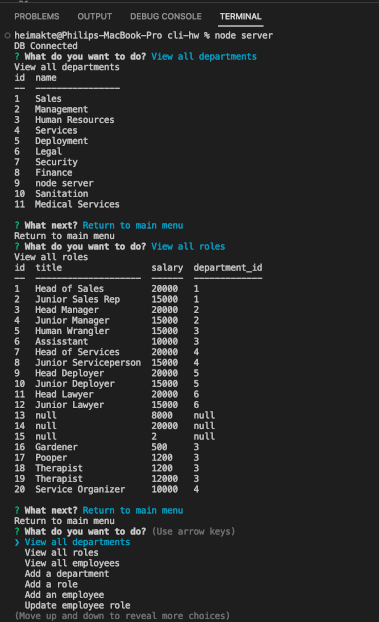

# Employee Manager 

## Table of Contents

### [Description](#Description)

### [Installation](#Installation)

### [Usage](#Usage)

### [Testing](#Testing)

### [Contributors](#Contributors)

### [License](#License)

### [Questions](#Questions)

## Description

This is a program designed to keep track of all employees, departments, salaries, and job titles

## Installation

The program is run in the CLI. First, copy the repo, then open it in VS code

## Usage

Once you have downloaded the code and opened it in a code editor, start the cli by typing 'node server' into the terminal

## Testing

One could write extensive tests with jest and supertest. If you do please submit a pull request, I will happily merge them into the program!

## Contributors

This was built from scratch by me. However, there were some long discussions with Chat GPT on how to improve functionality and get some of the dynamic elements to work properly

## License

This is a program designed to keep track of all employees, departments, salaries, and job titles

## Questions

Philip Scott Neumann

https://github.com/moviefan322

philman202@yahoo.com
